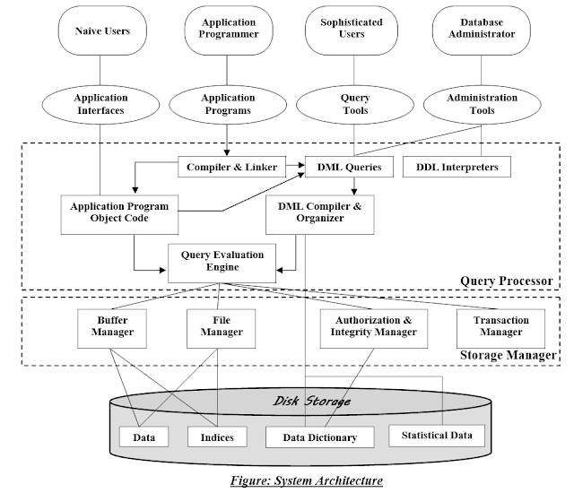

# DB 트랜잭션과 격리수준
## DB 트랜잭션
> SQL(데이터베이스 질의어)로 데이터베이스 상태변화를 일으키는 작업단위
#### SQL(데이터베이스 질의어)
+ DDL(Data Define Language) 데이터베이스 정의어: create, drop, alter, truncate
+ DML(Data Manipulation Language) 데이터베이스 조작어: select, insert, delete, update
+ DCL(Data Control Language) 데이터베이스 제어어 : grant, revoke
+ TCL(Transaction Control Language) 트랜잭션 제어어 : commit, rollback, savepoint
#### 🤔 select가 왜 상태변화인가?
+ select 트랜잭션에서도 db s lock 발생
#### 작업단위
+ 트랜잭션에서 내에서 행해지는 데이터 질의어
+ 많은 SQL 명령문들을 사람이 정하는 기준에 따라 정하는 것
### 트랜잭션의 종류
```sql
SELECT * FROM USER;             // 1. 자동 커밋 트랜잭션

BEGIN TRAN                      // 2. 명시적(사용자) 트랜잭션
SELECT * FROM USER
SELECT * FROM CITY
COMMIT TRAN
GO;

SET IMPLICIT_TRANSACTIONS ON    // 3. 암시적(시스템) 트랜잭션
...
-- COMMIT TRAN;

// 4. 일괄 처리 범위의 트랜잭션
```
#### 🤔 명시적 트랜잭션과 암시적 트랜잭션의 차이
+ 암시적 트랜잭션에는 트랜잭션의 종료를 직접 써줘야 한다.
#### 🤔 일괄 처리 범위의 트랜잭션
+ MARS(Multiple Active Result Sets)에만 해당되며, MARS 세션에서 시작되는 T-SQL 명시적 또는 암시적 트랜잭션이 일괄 처리 범위 트랜잭션이 된다.
+ 하나의 Connection에서 여러 SqlCommand를 사용해서 각각 다른 ResultSet들을 동시에 사용할 수 있도록 한 것
### 트랜잭션의 특징
+ ```ACID```
+ 원자성(Atomicity): all or not
+ 일관성(Consistency): db 상태의 일관성, 트랜잭션 실행 전, 후 동일
+ 독립성(Isolation): 트랜잭션 병행실행시 트랜잭션이 서로 다른 트랜잭션에 영향을 줄 수 없다.
+ 지속성(Durability): 트랜잭션 결과가 영구적으로 반영되어야 한다.
#### 🤔 rollback은 지속성이 지켜지는 것인가?
+ rollback은 트랜잭션 비정상적으로 종료되어 원자성이 깨졌을 때, 트랜잭션 시작 시점으로 돌아가 트랜잭션을 재시작하거나, 폐기하게 하는 연산
+ 지속성 측면에서 보면, 이전 트랜잭션들의 결과가 그대로 반영되어 있다.
+ 폐기되는 경우 없는 트랜잭션으로 간주하므로 지속성이 깨지지 않는다.
<br>
### [Transaction 관리를 위한 DBMS의 전략](https://d2.naver.com/helloworld/407507)

+ 상부 질의처리기 + 하부 저장시스템(페이지 버퍼)
#### 페이지 버퍼 관리자(Page Buffer Manager)
+ Main Memory 관리 모듈
+ 버퍼 관리 정책에 따라서 트랜잭션의 UNDO 복구와 REDO 복구가 요구되거나 그렇지 않게 된다.
+ 시스템 회복  
  + REDO: commit된 것을 다시 실행
    + STEAL: 수정된 페이지를 언제든지 디스크에 쓸 수 있는 정책
    + ¬STEAL: 수정된 페이지들을 최소한 트랜잭션 종료 시점(EOT, End of Transaction)까지는 버퍼에 유지하는 정책
  + UNDO: 트랜잭션은 시작됐지만 commit 되지 않은 것의 연산 취소
    + FORCE: 수정했던 모든 페이지를 트랜잭션 커밋 시점에 디스크에 반영하는 정책
    + ¬FORCE: 수정했던 페이지를 트랜잭션 커밋 시점에 디스크에 반영하지 않는 정책
> DBMS는 버퍼 관리 정책으로 STEAL과 ¬FORCE 정책을 채택하고 있어, 이로 인해서 UNDO 복구와 REDO 복구가 모두 필요하게 된다.
#### 🤔 장애로 인해 재시작되면 어떻게 복구가 되나?
1. 로그분석, checkpoint 확인
2. REDO 복구 단계
3. UNDO 복구 단계
<br>
   


## 트랜잭션 격리수준 (Transaction Isolation Level)
> 일관성 없는 데이터에 대한 허용수준
 
```SHOW VARIABLES like 'tx_isolation';```
#### 🤔 일관성 없는 데이터를 왜 허용하는가? (= 트랜잭션의 필요성)
+ 여러 트랜잭션을 처리할 때, 다른 트랜잭션으로 Lock 되어 있는 데이터로 인해 트랜잭션의 원활한 처리가 어려워지기 때문에 Locking의 범위를 줄여 성능을 높인다.
### Locking
+ 공유 락(s), 업데이트 락(u), 단독 락(x)
+ 내재 락(is, ix, six)
### 트랜잭션 격리수준 종류
#### Read Uncommitted (레벨 0)
+ commit 되지 않은 데이터도 다른 트랜잭션이 읽기 때문에 일관성 깨짐
+ commit, rollback 여부와 무관
+ dirty read 발생
#### Read Committed (레벨 1)
+ commit된 트랜잭션만 조회가능
+ Oracle Default값 
+ non-repeatable read 발생
  + 같은 트랜잭션에서 commit 이후의 조회값이 달라지게 되는 것
#### Repeatable Read (레벨 2)
+ 트랜잭션 ID보다 작은 트랜잭션 번호에서 변경한 것만 읽는 것
+ MySQL의 InnoDB Default값
+ phantom read 발생 (MySQL의 InnoDB는 해당없음)
  + ```SELECT ... FOR UPDATE``` 쿼리와 같은 쓰기 잠금을 거는 경우 다른 트랜잭션에서 수행한 변경 작업에 의해 레코드가 보였다가 안 보였다가 하는 현상
  + 하나의 트랜잭션 내에서 조회 쿼리 결과 레코드의 수가 달라질 수 있다
#### 🤔 MySQL의 InnoDB는 왜 phantom read가 발생하지 않는가?
+ [공식문서](https://dev.mysql.com/doc/refman/8.0/en/innodb-next-key-locking.html)
+ 레코드 락과 갭 락을 합친 **넥스트 키 락**을 사용
#### Serializable (레벨 3)
+ 가장 엄격한 수준, 동시처리가 거의 불가능함
+ 트랜잭션을 다른 트랜잭션으로부터 완전히 분리하는 격리 수준
+ 모든 부정합 문제가 발생하지 않는다.
#### 부정합 문제
|격리수준|dirty read|non-repeatable read|phantom read|
|---|:---:|:---:|:---:|
|READ UNCOMMITRED|O|O|O|
|READ COMMITRED|X|O|O|
|REPEATABLE READ|X|X|O|
|SERIALIZABLE|X|X|X|
> 동시성을 증가시키면 데이터 무결성에 문제가 발생하고, 데이터 무결성(완전,일관,정확)을 유지하면 동시성이 떨어지게 됨

<br>


## 꼬리질문들
+ 트랜잭션이란
+ 트랜잭션 특징 ACID
+ 트랜잭션 상태
+ DDL와 DML의 종류
+ Commit
+ Rollback
+ DB의 transaction은 무엇이고 개념적으로 어떻게 동작하는지  
+ 트랜잭션 격리수준에 대한 설명과 격리수준 종류
+ 부정합 문제를 설명하라
+ InnoDB 스토리지 엔진을 사용하면 왜 PHANTOM READ 문제가 발생하지 않는가?  

+ [Spring JPA](https://tech.wheejuni.com/2018/06/09/jpa-questions/)
  + 그러면 Spring Data JPA에서 영속성 콘텍스트는 언제 열리고 언제 닫히나?
  + Transaction이 지연되어 실행된다고 했는데 그러면 내부적으로 dirty read와 같은 현상이 재현되는 것 아닌가?
<br>

<hr/>

#### 출처
+ [DB 트랜잭션과 격리수준](https://github.com/gyoogle/tech-interview-for-developer/blob/master/Computer%20Science/Database/Transaction.md)
+ [트랜잭션 종류](http://egloos.zum.com/sweeper/v/3003805)
+ [트랜잭션의 성질](https://hanamon.kr/%EB%8D%B0%EC%9D%B4%ED%84%B0%EB%B2%A0%EC%9D%B4%EC%8A%A4-%ED%8A%B8%EB%9E%9C%EC%9E%AD%EC%85%98%EC%9D%98-acid-%EC%84%B1%EC%A7%88/)
+ [Transaction 관리를 위한 DBMS의 전략](https://d2.naver.com/helloworld/407507)
+ [Draw the database system architecture. DBMS](https://onlineclassnotes.com/draw-database-system-architecture-dbms/)
+ [DB <UNDO, REDO>](https://writemylife.tistory.com/50)
+ [MySQL 트랜잭션 격리 수준](https://steady-coding.tistory.com/562)