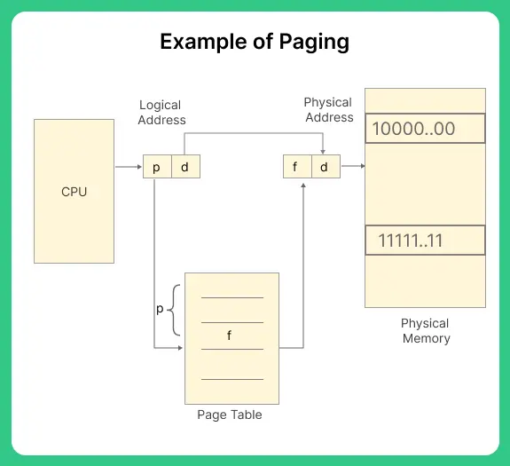
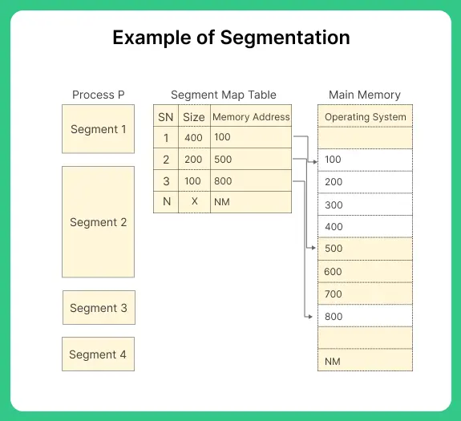
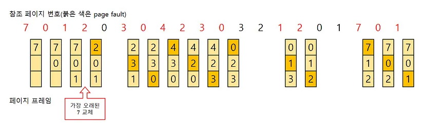
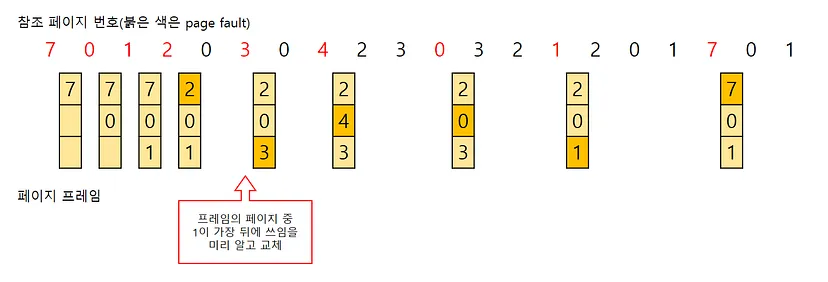
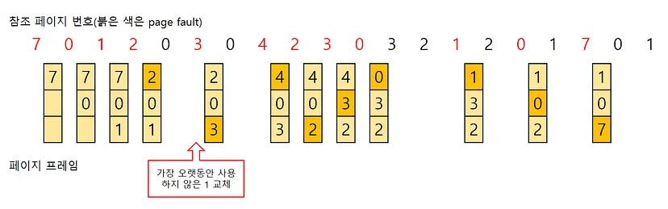

# 페이징과 세그먼테이션
+ 사용자 프로세스 영역 메모리에 어떻게 프로세스를 할당할 것인가?
> **페이지와 세그먼테이션 기법을 왜 쓰는가?**
>   + 다중 프로그래밍 시스템에서 다수 프로세스를 수용하기 위해 주기억장치를 동적으로 분할하는 메모리 관리 작업이 필요하다.

> **메모리 관리 기법에서 페이지와 세그먼테이션 기법은 어떤 메모리 관리 기법에 속하는가?**
>   + 둘 다 '불연속 메모리 관리'에 속하며, 페이징은 '고정 크기', 세그먼테이션은 '가변 크기' 메모리 관리 기법에 속한다
 

## 기본개념
+ 메모리 : OS 상주 영역과 **사용자 프로세스 영역**으로 구분
+ 단편화
  + 내부 단편화 (내부조각): 프로세스보다 더 큰 메모리 할당으로 발생하는 낭비
  + 외부 단편화 (외부조각): 프로세스 크기가 더 커서 적재하지 못하고 남는 빈 메모리 공간이 발생
 
 

## 메모리 관리 기법의 분류

### 1. 연속 메모리 관리 (Contiguous allocation)
+ 연속 할당
#### 1-1. 고정 분할 기법
+ 고정된 파티션으로 분할
  + 프로세스 수의 제한
+ 내부 단편화 발생
#### 1-2. 동적(가변) 분할 기법
+ 파티션이 동적으로 생성되어 자신의 크기와 같은 파티션에 적재
+ 최소 적합, 최적 적합, 최악 적합
+ 외부 단편화 발생
  + 해결방안: 컴팩션으로 가용공간을 확보하는 방법, 많은 비용
### 2. 불연속 메모리 관리 (Non-Contiguous allocation)
+ 다른 주소 공간에 할당 -> 주소 변환으로 인한 CPU 오버헤드 증가, 프로세스 수행시간의 증가
#### 페이징
+ 프로세스의 주소 공간을 페이지라는 균등한 사이즈로 나누어 물리적 메모리에 불연속으로 저장하는 방식
+ 외부 단편화 X, 내부 단편화 O
+ 페이지: 고정 사이즈의 작은 프로세스 조각

#### 세그먼테이션
+ 외부 단편화 O, 내부 단편화 X
+ 세그먼트: 서로 다른 크기를 가진 논리적 블록이 연속적 공간에 배치되는 것

 

#### 분류
+ 단순 페이징, 단순 세그먼테이션
+ 가상 메모리 페이징, 가상 메모리 세그먼테이션
  + 전부 로드하지 않고 필요한 페이지나 세그먼트들을 자동으로 불러들이는 것
 
 

# 페이지 교체 알고리즘
> **페이지 교체 알고리즘 필요성**
> + 새로운 페이지를 할당해야 하는데, 어떤 페이지를 교체할 것인가를 정해야 한다. 
> + 요구 페이지 기법에 필요한 페이지만을 메모리에 적재한다. 필요한 페이지가 있다면 안 쓰는 페이지를 OUT(victim page) 하고, 필요한 페이지를 IN 해야 한다. 

> **페이지 교체 알고리즘의 종류와 특징** 
> + FIFO, OPT, LRU
 
 
## FIFO 알고리즘 (First In First Out)

+ 가장 먼저 올라온 페이지를 OUT
+ 들어온 시간이나 순서를 큐로 저장해서 이용하며 구현이 쉽다
+ 활발히 사용중인 페이지를 계속 교체하면 페이지 부재율이 높아지고 실행속도가 떨어질 수 있다.
## OPT 알고리즘 (Optimal)

+ 앞으로 사용되지 않을 페이지를 OUT
+ 실제로 구현이 어렵고, 연구목적을 위해 사용된다
## LRU 알고리즘 (Least Recently Used)

+ 최근에 사용하지 않은 페이지를 OUT
+ OPT 알고리즘보다 실질적으로 사용이 가능한 알고리즘
+ 실제로 사용할 수 있는 페이지 교체 알고리즘에서는 가장 좋은 방법 중 하나, 많은 운영체제가 채택
## LFU 알고리즘 (Least Frquently Used)
+ 참조횟수가 가장 적은 페이지를 교체하는 알고리즘
## MFU 알고리즘 (Most Frequently Used)
+ 참조횟수가 가장 많은 페이지를 교체하는 알고리즘

## 교체 방식
+ Global, Local 교체
  + 메모리 상의 모든/자기 프로세스 페이지에서만 교체
 

#### 출처
+ 운영 체제와 정보기술의 원리(반효경 저)
+ https://www.codingninjas.com/codestudio/library/difference-between-contiguous-and-non-contiguous-allocation
+ https://prepinsta.com/operating-systems/difference-between-segmentation-and-paging/
+ https://code-lab1.tistory.com/60
