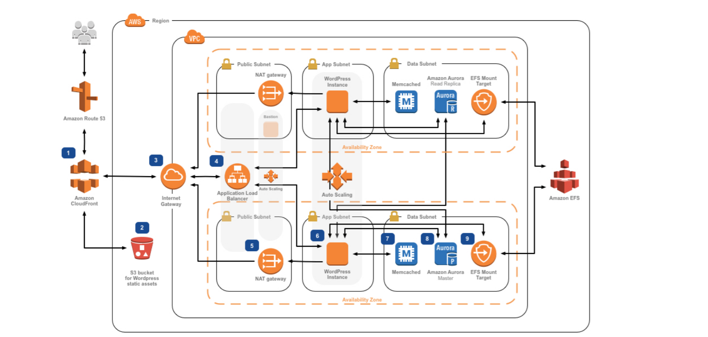

# [디자인 패턴의 개요](https://github.com/gyoogle/tech-interview-for-developer/blob/master/Design%20Pattern/%5BDesign%20Pattern%5D%20Overview.md)
> 디자인 패턴과 종류를 설명해보세요.<br>
> 프로젝트에 사용된 아키텍처와 디자인 패턴은 무엇인가요?

<br>

## 디자인 패턴이란?
+ 소프트웨어 공학의 소프트웨어 디자인에서 특정 문맥에서 공통적으로 발생하는 문제에 대해 재사용 가능한 해결책입니다.
+ **SW 재사용성, 호환성, 유지보수성**을 보장하기 위한 설계 기법/방법
+ 객체지향 프로그래밍의 ```객체``` 자체를 사용하는 방법을 정형화한 것

<br>


## SOLID 원칙 (객체지향 5대 원칙)
> SRP, OCP, LSP, ISP, DIP
+ ```높은 응집도```와 ```낮은 결합도```를 추구하기 위한 설계 원칙
#### Single Responsibility Principle, 단일 책임 원칙
+ 클래스나 함수는 단 하나의 기능만을 가져야 한다.
#### Open-Close Principle, 개방-폐쇄 원칙
+ 자주 변경될 수 있는 부분은 수정, 확정이 쉬워야 하고, 자주 변경되지 않는 부분은 수정에 영향을 받지 않게 설계해야 합니다.
#### Liskov Substitution Principle, 리스코프 치환 원칙
+ 자식 클래스는 부모 클래스를 대체할 수 있어야 합니다.
+ 자식 클래스는 부모 클래스의 행위와의 일관성이 있어야 하며, 부모 클래스 대신 자식 클래스를 사용해도 문제가 없어야 합니다.
#### Interface Segregation Principle, 의존 역전 원칙
+ 변화하기 어려운 것에 의존해야 한다는 원칙이다. 즉, 여기서 변화하기 어려운 것이란 ```추상 클래스, 인터페이스```를 말합니다.
+ 의존성 주입
#### Dependency Inversion Property, 인터페이스 분리 원칙
+ 하나의 일반적인 인터페이스보다는 여러 개의 구체적인 인터페이스가 낫습니다.
+ 클라이언트가 꼭 필요한 메서드만 사용할 수 있도록 합니다.

<br>

## GoF(Gang of Four) 디자인 패턴
+ 에릭 감마, 리차드 헬름, 랄프 존슨, 존 블리시데스


### 객체 생성 관련 패턴
+ ```객체```의 생성 방식 결정
+ 클라이언트와 그 클라이언트가 생성해야 하는 객체 인스턴스 사이의 연결을 끊어주는 패턴
> Abstract Factory, Builder, Factory Method, Prototype, Singleton
+ ```Abstract Factory``` 패턴
  + 구체적인 클래스에 의존하지 않고 인터페이스를 통해 서로 연관/의존하는 객체들의 그룹으로 생성하려 추상적으로 표현함
+ ```Builder``` 패턴
  + 작게 분리된 인스턴스를 건축 하듯이 조합하여 객체를 생성함. 객체의 생성 과정과 표현 방법을 분리하고 있어, 동일한 객체 생성에서도 서로 다른 결과를 만들어낼 수 있음
+ ```Factory Method``` 패턴
  + 가상 생성자 패턴으로 객체 생성을 서브 클래스에서 처리하도록 분리하여 캡슐화 한 패턴으로 상위 클래스에서 인터페이스만 정의하고 실제 생성은 서브 클래스가 담당함.
+ ```Prototype``` 패턴
  + 원본 객체를 복제하는 방법으로 객체를 생성하는 패턴으로 일반적인 방법으로 객체를 생성하며 비용이 큰 경우 주로 이용함
+ ```Singleton``` 패턴
  + 하나의 객체를 생성하면 생성된 객체를 어디서든 참조할 수 있지만, 여러 프로세스가 동시에 참조할 수는 없고 클래스 내에서 인스턴스가 하나뿐임을 보장하며, 불필요한 메모리 낭비를 최소화할 수 있음
### 구조 관련 패턴
+ 객체 간의 ```관계```를 조직
+ 클래스와 객체를 더 큰 구조로 만들 수 있게 구성을 사용하는 패턴
> Adapter, Bridge, Proxy, Composite, Decorator, Facade, Flyweight
+ ```Adapter``` 패턴
  + 호환성이 없는 클래스들의 인터페이스를 다른 클래스가 이용할 수 있도록 변환해주는 패턴으로, 기존의 클래스를 이용하고 싶지만 인터페이스가 일치하지 않을 때 이용함
+ 📌 ```Bridge``` 패턴
  + 기능을 처리하는 클래스와 구현을 담당하는 추상 클래스로 구별한다.
  + 구현뿐 아니라 **추상화도 독립적 변경이 필요할 때** 브리지 패턴을 사용한다.
  + 기존 시스템에 부수적인 새로운 기능들을 지속적으로 추가할 때 사용하면 유용하며, 새로운 인터페이스를 정의하여 기존 프로그램의 변경 없이 기능을 확장할 수 있다.
+ ```Composite``` 패턴
  + 여러 객체를 가진 복합 객체와 단일 객체를 구분 없이 다루고자 할 때 사용하는 패턴으로, 객체들을 트리 구조로 구성하여 디렉터리 안에 디렉터리가 있듯이 복합 객체 안에 복합 객체가 포함되는 구조를 구현할 수 있음
+ ```Decorator``` 패턴
  + 객체 간의 결합을 통해 능동적으로 기능들을 확장할 수 있는 패턴으로, 임의의 객체에 부가적인 기능을 추가하기 위해 다른 객체들을 덧붙이는 방식으로 구현함
+ ```Facade``` 패턴
  + 복잡한 서브 클래스들을 피해 더 상위에 인터페이스를 구성함으로써 서브 클래스들의 기능을 간편하게 사용할 수 있도록 하는 패턴으로, 서브 클래스들 사이의 통합 인터페이스를 제공하는 Wrapper 객체가 필요함
+ ```Flyweight``` 패턴
  + 인스턴스가 필요할 때마다 매번 생성하는 것이 아니고 가능한 한 공유해서 사용함으로써 메모리를 절약하는 패턴으로, 다수의 유사 객체를 생성하거나 조작할 때 유용하게 사용할 수 있음
+ ```Proxy``` 패턴
  + 접근이 어려운 객체와 여기에 연결하려는 객체 사이에서 인터페이스 역할을 수행하는 패턴으로 네트워크 연결, 메모리의 대용량 객체로의 접근 등에 주로 이용함
### 행동 관련 패턴
+ 객체의 ```행위```를 조직, 관리, 연합
+ 클래스와 객체들이 상호작용하는 방법과 역할을 분담하는 방법을 다루는 패턴
> Chain of Responsibility, Command, Interpreter, Iterator, Mediator, Observer, State, Strategy, Visitor
+ ```Chain of Responsibility``` 패턴
  + 요청을 처리할 수 있는 객체가 둘 이상 존재하여 한 객체가 처리하지 못하면 다음 객체로 넘어가는 형태의 패턴으로, 요청을 처리할 수 있는 각 객체들이 고리로 묶여 있어 요청이 해결될 때까지 고리를 따라 책임이 넘어감
+ ```Command``` 패턴
  + 요청을 객체의 형태로 캡슐화하여 재이용하거나 취소할 수 있도록 요청에 필요한 정보를 저장하거나 로그에 남기는 패턴으로, 요청에 사용되는 각종 명령어들을 추상 클래스와 구체 클래스로 분리하여 단순화함
+ ```Interpreter``` 패턴
  + 언어에 문법 표현을 정의하는 패턴으로, SQL이나 통신 프로토콜과 같은 것을 개발할 때 사용함
+ ```Iterator``` 패턴
  + 자료 구조와 같이 접근이 잦은 객체에 대해 동일한 인터페이스를 사용하도록 하는 패턴으로, 내부 표현 방법의 노출 없이 순차적인 접근이 가능함
+ ```Mediator``` 패턴
  + 수 많은 객체들 간의 복잡한 상호작용을 캡슐화하여 객체로 정의하는 패턴으로, 객체 사이의 의존성을 줄여 결합도를 감소시킬 수 있음
+ ```Mememto``` 패턴
  + 특정 시점에서의 객체 내부 상태의 객체화함으로써 이후 요청에 따라 객체를 해당 시점의 상태로 돌릴 수 있는 기능을 제공하는 패턴으로, [Ctrl]+[Z]와 같은 되돌리기 기능을 개발할 때 주로 이용함
+ ```State``` 패턴
  + 객체의 상태에 따라 동일한 동작을 다르게 처리해야 할 때 사용하는 패턴으로 객체 상태를 캡슐화하고 이를 참조하는 방식으로 처리함
+ 📌 ```Observer``` 패턴
  + 한 객체의 상태가 변화하면 객체에 상속되어 있는 다른 객체들에게 변화된 상태를 전달해주는 패턴이다.
  + 일대다 관계를 가지며, 주로 분산된 시스템 간에 이벤트를 생성·발행(Publish)하고, 이를 수신(Subscribe)해야 할 때 이용한다.
+ ```Strategy``` 패턴
  + 동일한 계열의 알고리즘을 개별적으로 캡슐화하여 상호 교환할 수 있게 정의하는 패턴으로 클라이언트는 독립적으로 원하는 알고리즘을 선택하여 사용할 수 있으며, 클라이언트에 영향 없이 알고리즘의 변경이 가능함
+ ```Template Method``` 패턴
  + 상위 클래스에서 골격을 정의하고, 하위 클래스에서 세부 처리를 구체화는 구조의 패턴으로, 유사한 서브 클래스를 묶에 공통된 내용을 상위 클래스에서 정의함으로써 코드의 양을 줄이고 유지보수를 용이하게 해줌
+ ```Visitor``` 패턴
  + 각 클래스들의 데이터 구조에서 처리 기능을 분리하여 별도의 클래스로 구성하는 패턴으로, 분리된 처리 기능은 각 클래스를 방문하여 수행함

<br>

## 😨 MVC는 디자인 패턴인가 OR 아키텍처인가 
#### Martin Fowler
+ 소프트웨어 개발 방법론, 소프트웨어 아키텍처, 리팩토링의 저자
+ 자신의 블로그에서 "MVC 아키텍처"라는 용어를 사용하며, MVC를 설명하고 있습니다.
#### Erich Gamma
+ GOF(Gang of Four)라 불리는 디자인 패턴의 창시자
+ "Design Patterns: Elements of Reusable Object-Oriented Software"에서 "MVC 디자인 패턴"이라는 용어를 사용하며, MVC를 디자인 패턴 중 하나로 소개하고 있습니다.
#### ChatGPT 답변
MVC는 "Model-View-Controller"의 약어로, 소프트웨어 시스템의 구조를 나타내는 아키텍처 중 하나입니다. 따라서, MVC는 아키텍처입니다.
그러나, MVC는 동시에 디자인 패턴으로도 분류됩니다. 디자인 패턴은 일반적으로 소프트웨어 시스템에서 발견되는 문제를 해결하는 일반적인 해결책을 제공하는 것으로 정의되기 때문입니다.
그러나, 누군가는 MVC가 아키텍처가 아니라는 주장도 할 수 있습니다. 이는, MVC가 간단한 아키텍처 모델에 해당하며, 실제로는 더 복잡한 아키텍처 모델을 따르는 소프트웨어 시스템도 많이 있기 때문입니다.
즉, MVC는 아키텍처이기도 하고, 디자인 패턴이기도 하며, 소프트웨어 시스템의 구조를 설계하거나 이해하는 데 도움을 줄 수 있는 유용한 도구입니다.



<br><br>
<hr>

#### 출처
[소프트웨어 디자인 패턴](https://ko.wikipedia.org/wiki/%EC%86%8C%ED%94%84%ED%8A%B8%EC%9B%A8%EC%96%B4_%EB%94%94%EC%9E%90%EC%9D%B8_%ED%8C%A8%ED%84%B4)<br>
[디자인 패턴 개념 및 종류와 SOLID 원칙](https://devmoony.tistory.com/42)<br>
[Gang of Four Design Patterns](https://www.javaguides.net/2019/01/gof-gang-of-four-design-patterns.html)<br>

