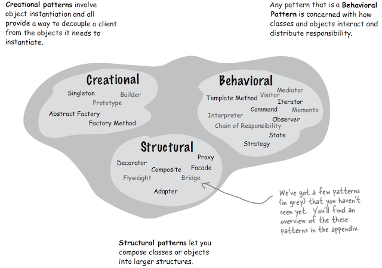

# [디자인 패턴의 개요](https://github.com/gyoogle/tech-interview-for-developer/blob/master/Design%20Pattern/%5BDesign%20Pattern%5D%20Overview.md)
> 디자인 패턴과 종류를 설명해보세요.<br>
> 프로젝트에 사용된 아키텍처와 디자인 패턴은 무엇인가요?

## 디자인 패턴이란?
+ 소프트웨어 공학의 소프트웨어 디자인에서 특정 문맥에서 공통적으로 발생하는 문제에 대해 재사용 가능한 해결책입니다.
+ **SW 재사용성, 호환성, 유지보수성**을 보장하기 위한 설계 기법/방법
+ 객체지향 프로그래밍의 ```객체``` 자체를 사용하는 방법을 정형화한 것

## SOLID 원칙 (객체지향 5대 원칙)
> SRP, OCP, LSP, ISP, DIP
+ ```높은 응집도```와 ```낮은 결합도```를 추구하기 위한 설계 원칙
#### Single Responsibility Principle, 단일 책임 원칙
+ 클래스나 함수는 단 하나의 기능만을 가져야 한다.
#### Open-Close Principle, 개방-폐쇄 원칙
+ 자주 변경될 수 있는 부분은 수정, 확정이 쉬워야 하고, 자주 변경되지 않는 부분은 수정에 영향을 받지 않게 설계해야 한다.
#### Liskov Substitution Principle, 리스코프 치환 원칙
+ 자식 클래스는 부모 클래스를 대체할 수 있어야 한다.
+ 자식 클래스는 부모 클래스의 행위와의 일관성이 있어야 하며, 부모 클래스 대신 자식 클래스를 사용해도 문제가 없어야 한다.
#### Interface Segregation Principle, 의존 역전 원칙
+ 변화하기 어려운 것에 의존해야 한다는 원칙이다. 즉, 여기서 변화하기 어려운 것이란 ```추상 클래스, 인터페이스```를 말한다.
+ 의존성 주입
#### Dependency Inversion Property, 인터페이스 분리 원칙
+ 하나의 일반적인 인터페이스보다는 여러 개의 구체적인 인터페이스가 낫다.
+ 클라이언트가 꼭 필요한 메서드만 사용할 수 있도록 한다.

## GoF(Gang of Four) 디자인 패턴
+ 에릭 감마, 리차드 헬름, 랄프 존슨, 존 블리시데스



### 객체 생성 관련 패턴
> 추상 팩토리 / 빌더 / 팩토리 메소드 / 프로토타입 / 싱글턴
+ ```객체```의 생성 방식 결정
+ 클라이언트와 그 클라이언트가 생성해야 하는 객체 인스턴스 사이의 연결을 끊어주는 패턴
### 구조 관련 패턴
> 어댑터 / 브리지 / 컴포지트 / 데코레이터 / 퍼사드 / 플라이웨이트 / 프록시
+ 객체 간의 ```관계```를 조직
+ 클래스와 객체를 더 큰 구조로 만들 수 있게 구성을 사용하는 패턴
### 행동 관련 패턴
> 책임 연쇄 / 커맨드 / 인터프리터 / 반복자 / 중재자 / 메멘토 / 옵서버 / 상태 / 전략 / 템플릿 메소드 / 비지터
+ 객체의 ```행위```를 조직, 관리, 연합
+ 클래스와 객체들이 상호작용하는 방법과 역할을 분담하는 방법을 다루는 패턴

<br><br>
<hr>

#### 출처
[소프트웨어 디자인 패턴](https://ko.wikipedia.org/wiki/%EC%86%8C%ED%94%84%ED%8A%B8%EC%9B%A8%EC%96%B4_%EB%94%94%EC%9E%90%EC%9D%B8_%ED%8C%A8%ED%84%B4)<br>
[디자인 패턴 개념 및 종류와 SOLID 원칙](https://devmoony.tistory.com/42)<br>
[Gang of Four Design Patterns](https://www.javaguides.net/2019/01/gof-gang-of-four-design-patterns.html)<br>

