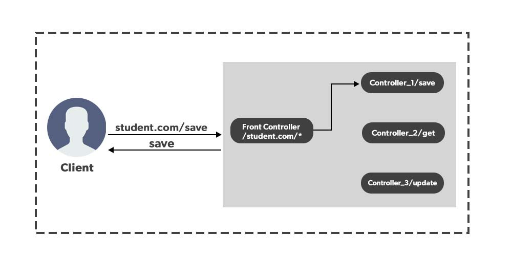

# [Dispatcher-Servlet](https://github.com/gyoogle/tech-interview-for-developer/blob/master/Interview/Interview%20List.md#%EC%8A%A4%ED%94%84%EB%A7%81)
> Dispatcher-Servlet은 어떤 역할을 하는가?

## Dispatcher, Servlet 단어의 이해
### Dispatcher
+ '급파하다', '파견'
+ 소프트웨어 모듈이나 시스템 구성 요소로서의 Dispatcher
  + 프로그램이 실행되면 그 프로세스들이 Ready Queue에 들어와 Ready 상태가 되는데 ```Dispatcher```에 의한 상태전이가 발생하게 되고, Running, 즉 실행상태가 된다.
  + 즉 Dispatcher는 이렇게 프로세스를 CPU에 **할당**시켜 실행상태로 가도록 하는 역할을 합니다.
### Servlet
+ 자바 언어로 작성된 서버 사이드 프로그래밍 기술
  + python의 WSGI(Web Server Gateway Interface)
  + PHP의 PHP-FPM(PHP FastCGI Process Manager)
  + Node.js의 Express.js
+ 웹 어플리케이션 서버에서 동작하며, 클라이언트 요청에 대한 응답을 처리하는데 사용됩니다.
+ Spring 등 다양한 자바 웹 프레임워크에서 사용됩니다.
```java
import java.io.IOException;
import javax.servlet.http.HttpServlet;
import javax.servlet.http.HttpServletRequest;
import javax.servlet.http.HttpServletResponse;

public class HelloWorldServlet extends HttpServlet {
    protected void doGet(HttpServletRequest request, HttpServletResponse response)
            throws IOException {
        response.setContentType("text/html");
        response.getWriter().println("<html><body><h1>Hello, World!</h1></body></html>");
    }
}
```
```xml
<?xml version="1.0" encoding="UTF-8"?>
<web-app xmlns:xsi="http://www.w3.org/2001/XMLSchema-instance"
    xmlns="http://java.sun.com/xml/ns/javaee"
    xsi:schemaLocation="http://java.sun.com/xml/ns/javaee http://java.sun.com/xml/ns/javaee/web-app_3_0.xsd"
    id="WebApp_ID" version="3.0">
    <display-name>HelloWorldWebApp</display-name>
    <servlet>
        <servlet-name>HelloWorldServlet</servlet-name>
        <servlet-class>HelloWorldServlet</servlet-class>
    </servlet>
    <servlet-mapping>
        <servlet-name>HelloWorldServlet</servlet-name>
        <url-pattern>/hello</url-pattern>
    </servlet-mapping>
</web-app>
```
## Dispatcher-Servlet
### 서블릿 컨테이너 - 프론트 컨트롤러(Dispatcher-Servlet) - 세부 컨트롤러



+ HTTP 프로토콜로 들어오는 모든 요청을 가장 먼저 받아 적합한 컨트롤러에 위임해주는 프론트 컨트롤러(Front Controller)
+ 공통처리 작업을 처리해주고 적절한 세부 컨트롤러로 작업을 위임
+ web.xml 역할의 축소
  + Spring gradle에서는 ```@``` 어노테이션을 사용해 매핑처리
    ```java
    import javax.servlet.annotation.WebServlet;
    import javax.servlet.http.HttpServlet;
    import javax.servlet.http.HttpServletRequest;
    import javax.servlet.http.HttpServletResponse;
    import java.io.IOException;
    
    @WebServlet("/hello")
    public class HelloWorldServlet extends HttpServlet {
        protected void doGet(HttpServletRequest request, HttpServletResponse response)
                throws IOException {
            response.setContentType("text/html");
            response.getWriter().println("<html><body><h1>Hello, World!</h1></body></html>");
        }
    }
    ```

### Spring과 Spring boot의 DispatcherServlet 차이
+ Spring Boot
  + Spring을 기반으로 자동 설정, 내장형 서버 등의 기능을 제공하여 개발자가 보다 쉽게 스프링 애플리케이션을 빠르게 개발할 수 있도록 도와주는 프레임워크입니다.
+ Spring과 Spring Boot에서 DispatcherServlet를 사용하는 코드는 크게 다르지 않지만, Spring Boot에서는 자동 설정(Auto Configuration)을 통해 기본적인 DispatcherServlet 구성을 제공합니다.
#### Spring에서의 DispatcherServlet 구성
```java
public class MyWebApplicationInitializer implements WebApplicationInitializer {

  @Override
  public void onStartup(ServletContext container) throws ServletException {
    AnnotationConfigWebApplicationContext ctx = new AnnotationConfigWebApplicationContext();
    ctx.register(MyConfiguration.class);
    ctx.setServletContext(container);

    ServletRegistration.Dynamic servlet = container.addServlet("dispatcher", new DispatcherServlet(ctx));
    servlet.setLoadOnStartup(1);
    servlet.addMapping("/");
  }

}

@Configuration
@EnableWebMvc
@ComponentScan("com.example.myapp")
public class MyConfiguration {

  @Bean
  public ViewResolver viewResolver() {
    InternalResourceViewResolver resolver = new InternalResourceViewResolver();
    resolver.setPrefix("/WEB-INF/views/");
    resolver.setSuffix(".jsp");
    return resolver;
  }

}
```
#### Spring boot에서의 DispatcherServlet 구성
```java
@SpringBootApplication
public class MyApplication {

    public static void main(String[] args) {
        SpringApplication.run(MyApplication.class, args);
    }

}
```
```properties
# application.properties
spring.mvc.view.prefix=/WEB-INF/views/
spring.mvc.view.suffix=.jsp
```
+ Webflux 모듈
  + WebFlux를 사용하여 Reactive Web Application을 개발할 수 있습니다. WebFlux는 비동기적이고 논블로킹(non-blocking) 웹 애플리케이션 개발을 위한 기능을 제공하는 모듈입니다. WebFlux를 사용하면 Reactor 라이브러리를 기반으로 하는 DispatcherHandler를 사용하여 HTTP 요청을 처리하게 됩니다.

<hr/>

#### 출처
https://mangkyu.tistory.com/18
https://www.geeksforgeeks.org/what-is-dispatcher-servlet-in-spring/ 
